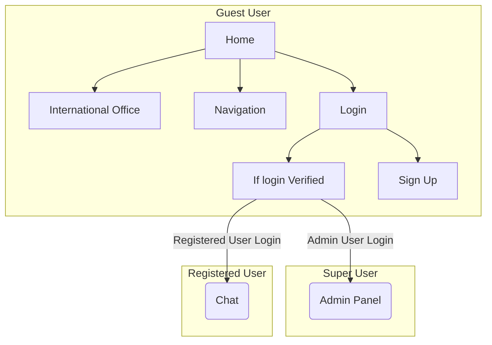

# THD Web Application

## Introduction

This Project is the Repository for the **Modern Internet Technologies** Course project. The Project is the **THD web application** and is developed using the following technologies:
   * Angular 11
   * Angular Material
   * Adobe XD
   * Express
   * Nodejs
   * Web Sockets
   * MongoDB
   

## Instructions for running the Project
1. Clone the git repository in your local machine.
2. Open the project in a text editor e.g. **Visual Studio Code** or **Sublime Text**, etc.
3. Open Terminal and navigate to the repository folder.
4. Once inside the repository folder, run `npm install` from the terminal to download all the required dependencies.
5. Run `ng serve` or `npm start` for a development server. 
6. Navigate to `http://localhost:4200/`.

## Structure of Application

## Test Cases

  
### 1. Login Test Cases

  1. **Registered User successful Login**
      - Click on **Login** Tab. A login form will pop up.
      - Enter `mati124@gmail.com` in the **User Name** field.
      - Enter `12345` as **Password**.
      - You will be redirected to **Home** Page with more feature accessibility.

  2. **Registered User successful Login**
      - Click on **Login** Tab. A login form will pop up.
      - Enter `mati124@gmail.com` in the **User Name** field.
      - Enter `12345` as **Password**.
      - You will be redirected to **Home** Page with more feature accessibility.

  3. **Registered User Login Verification**
        - Click on **Login** Tab. A login form will pop up.
        - Enter `mati124@gmail.com` in the **User Name** field.
        - Enter `12` as **Password**.
        - An error will prompt asking user to enter the correct credentials.

### 2. Sign Up Test Cases

  1. **User Registeration Successful**
      - Click on **Sign Up** button in the **Login** Form.
      - Enter `Tabdar` in the **First Name** field.
      - Enter `Khan` in the **Last Name** field.
      - Enter `tabi124@gmail.com` in the **User Name** field.
      - Enter `12345` as **Password**.
      - You will be redirected to **Login** Page with more feature accessibility.
      - Enter your credentials to Login.

  2. **User Registeration Unsuccessful** (User Already Exists)
      - Click on **Sign Up** button in the **Login** Form.
      - Enter the credentials entered in the above test case for user registration again.
      - An error will prompt saying that the **user already exists**.

  

